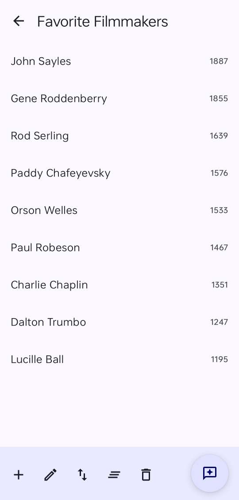

  

 <h3 align="center"><a href="https://github.com/dessalines/rank-my-favs">Rank-My-Favs</a></h3>
  

    Rank your favorite things, using simple pair-wise matchups.
     
     
    <a href="https://github.com/dessalines/rank-my-favs/issues">Report Bug</a>
    ·
    <a href="https://github.com/dessalines/rank-my-favs/issues">Request Feature</a>
    ·
    <a href="https://github.com/dessalines/rank-my-favs/releases">Releases</a>
  

  

    
    
    
    
  

## About Rank-My-Favs

  

Do you keep lists of your favorite things, such as movies, books, recipes, or music albums? You might keep list(s) that looks like this:

- Network (1976)
- Lone Star (1996)
- Devils (1971)
- The Seventh Seal (1957)
- ... _Many more films_

But how do you rank these?

You might be tempted to order them by preference, but this could quickly get overwhelming for long lists.

A much easier method is to use [pairwise comparisons](https://www.opinionx.co/blog/pairwise-comparison), which shows you single head-to-head pairs, and has you choose which one you like best.

After doing a small number of these matchups, Rank-My-Favs can confidently create a ranked list for you.

Under the hood, Rank-My-Favs uses the advanced [Glicko rating system](https://en.m.wikipedia.org/wiki/Glicko_rating_system), to determine how many matches are necessary, and for ranking.

### Features

- Import your existing lists quickly.
- Uses the advanced [Glicko rating system](https://en.m.wikipedia.org/wiki/Glicko_rating_system).

### Built With

- [Android Jetpack Compose](https://developer.android.com/jetpack/compose)

## Installation / Releases

- [Releases](https://github.com/dessalines/rank-my-favs/releases)
- [IzzyOnDroid](https://apt.izzysoft.de/fdroid/index/apk/com.dessalines.rankmyfavs)
- [F-Droid](https://f-droid.org/en/packages/com.dessalines.rankmyfavs/)
- [Google Play](https://play.google.com/store/apps/details?id=com.dessalines.rankmyfavs)

## Support / Donate

Rank-My-Favs will always remain free, open-source software. We've seen many open-source projects go unmaintained after a few years. **Recurring donations have proven to be the only way these projects can stay alive.**

Your donations directly support full-time development, and help keep this maintained. If you find yourself using rank-my-favs every day, consider donating:

- [Support me on Liberapay](https://liberapay.com/dessalines).
- [Support me Patreon](https://www.patreon.com/dessalines).

### Crypto

- bitcoin: `1Hefs7miXS5ff5Ck5xvmjKjXf5242KzRtK`
- ethereum: `0x400c96c96acbC6E7B3B43B1dc1BB446540a88A01`
- monero: `41taVyY6e1xApqKyMVDRVxJ76sPkfZhALLTjRvVKpaAh2pBd4wv9RgYj1tSPrx8wc6iE1uWUfjtQdTmTy2FGMeChGVKPQuV`

## Social / Contact

- [lemmy.ml/c/rankmyfavs](https://lemmy.ml/c/rankmyfavs)
- [Mastodon](https://mastodon.social/@dessalines)
- [Matrix chat](https://matrix.to/#/#rank-my-favs:matrix.org)

## Resources

- https://github.com/goochjs/glicko2
- https://prioneer.io/tools/pairwise-ranking-tool
- https://www.opinionx.co/research-method-guides/best-free-pairwise-ranking-tools
- https://medium.com/@anton.myller/from-elo-to-trueskill-a-journey-in-the-world-of-ranking-systems-part-i-b186341d5ed0
